# Armaan's Space Blaster

A Phaser arcade space shooter with generated sprite art, asteroids, UFO enemies, powerups, explosions, screen shake, level progression, and browser-based synth sound effects.

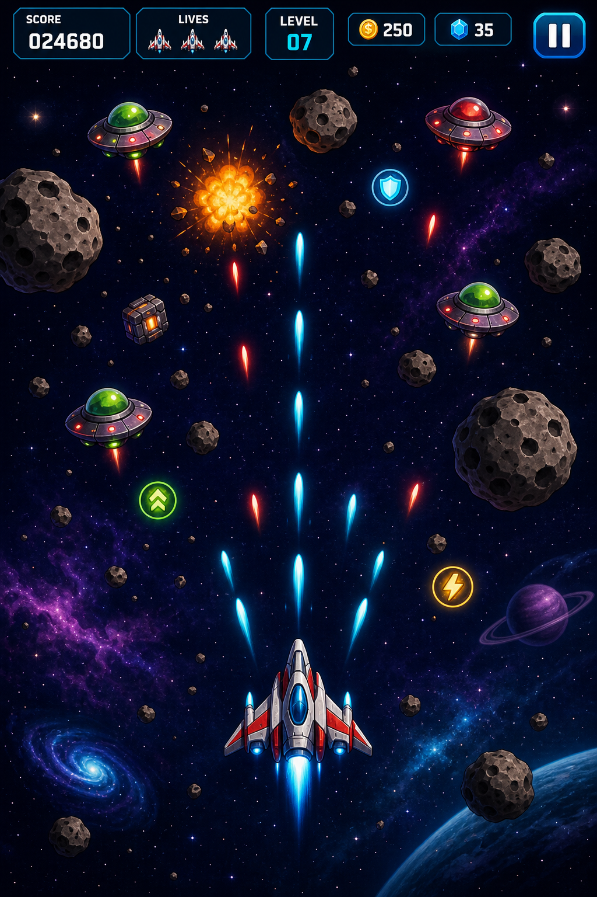

## Features

- Wide desktop arcade playfield built with Phaser
- Generated spaceship, asteroid, UFO, laser, powerup, and space background art
- New enemy variations: red raiders, organic aliens, large cruisers, and classic UFOs
- Multiple enemy weapon styles: plasma orbs, shards, missiles, and alien energy globs
- Big slow-motion spaceship death explosion with debris, shockwave, flash, and screen shake
- Asteroid waves that break into smaller rocks
- Giant asteroids and larger cruiser enemies appear as levels climb
- Shield, rapid-fire, double-shot, and repair powerups
- Score, lives, level progression, pause, game-over, and restart flow

## Sprite Pack

| Player Ship | Asteroid | Enemy UFO | Laser |
| --- | --- | --- | --- |
| 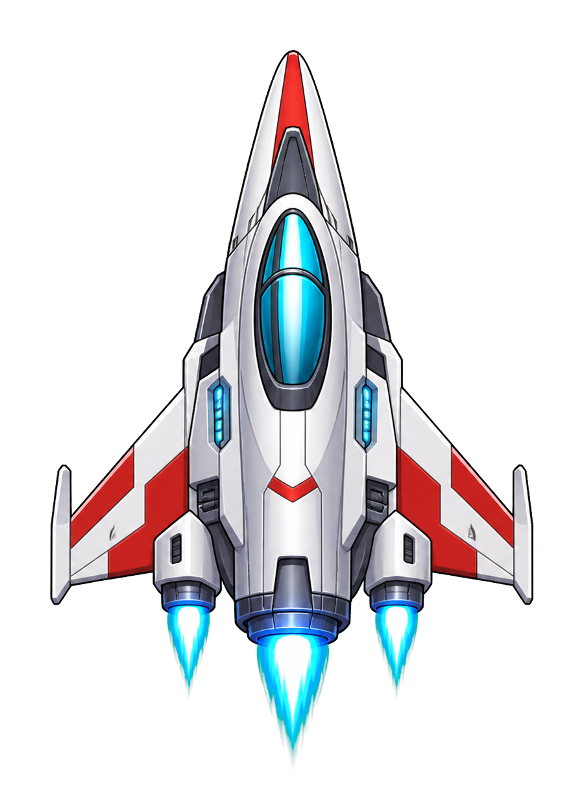 | 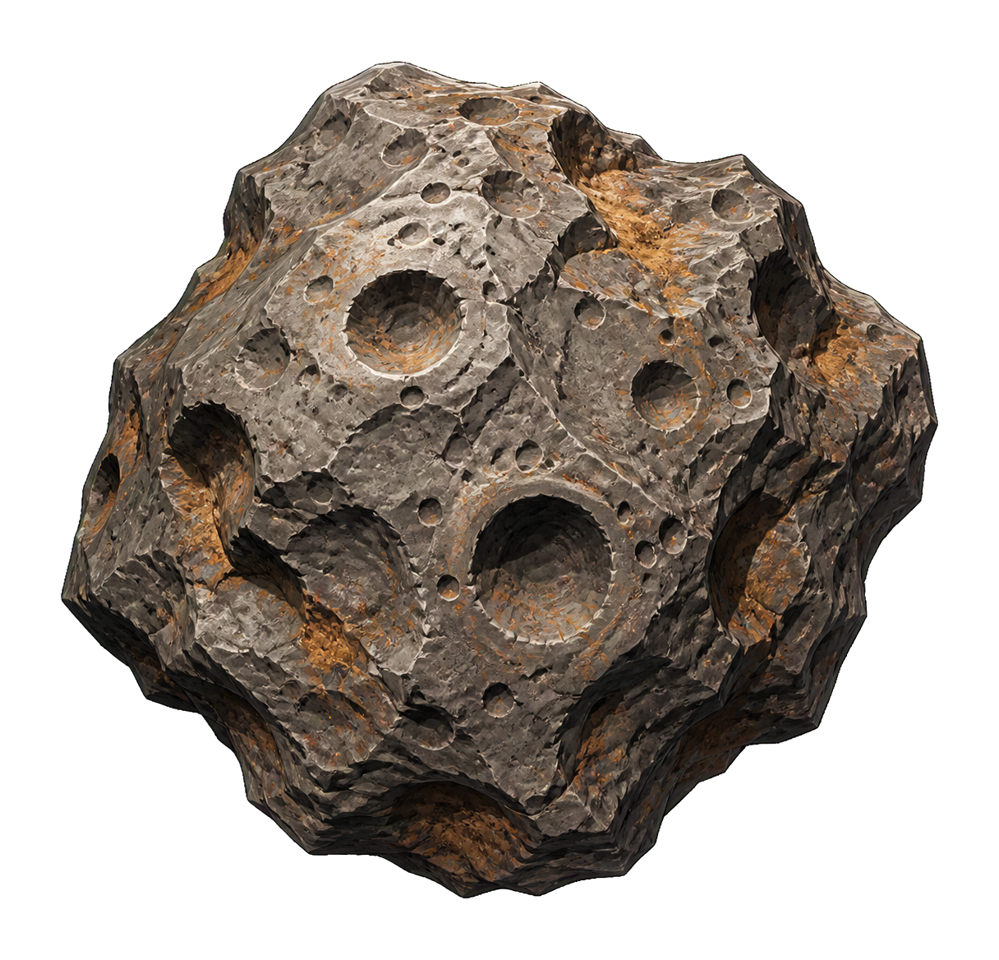 | 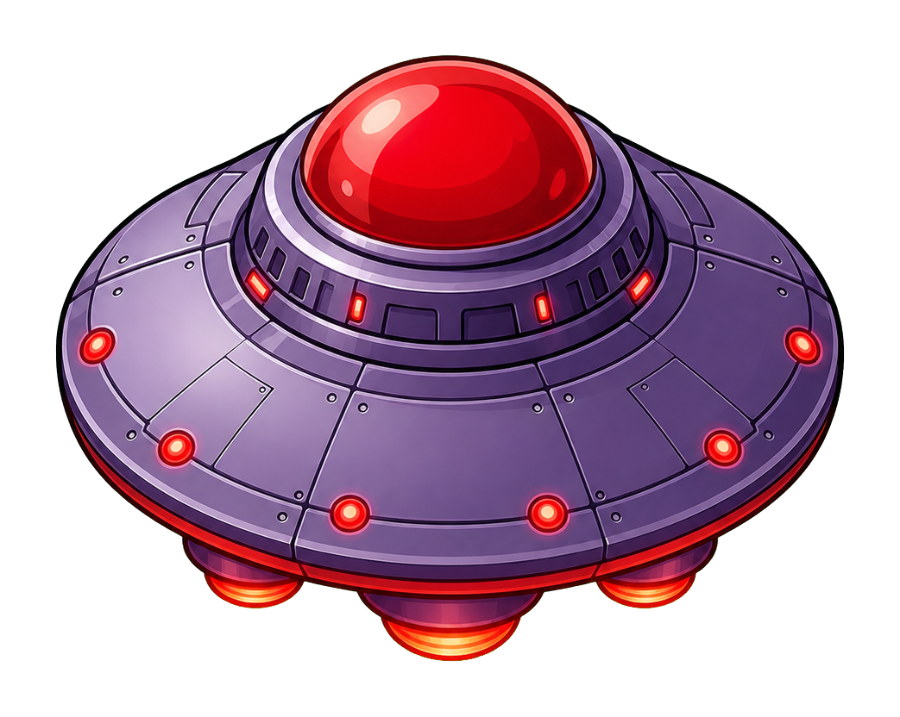 | 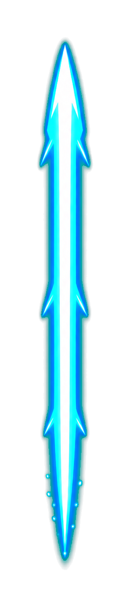 |

## Enemy Variations

| Raider | Organic Alien | Cruiser | Enemy Weapons |
| --- | --- | --- | --- |
| 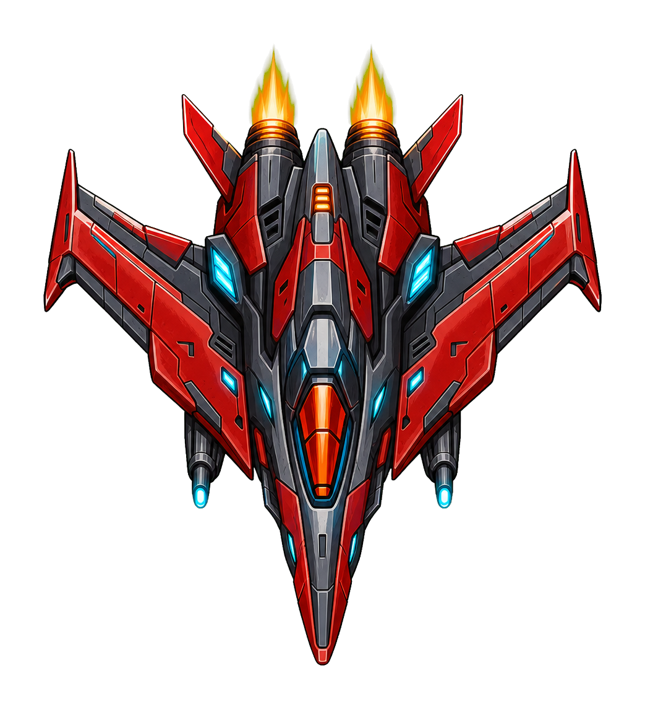 | 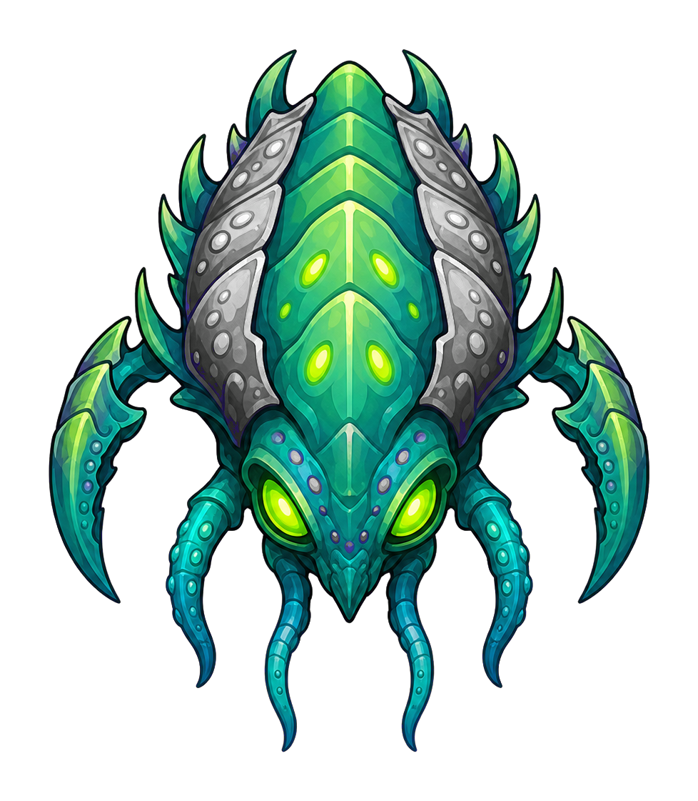 | 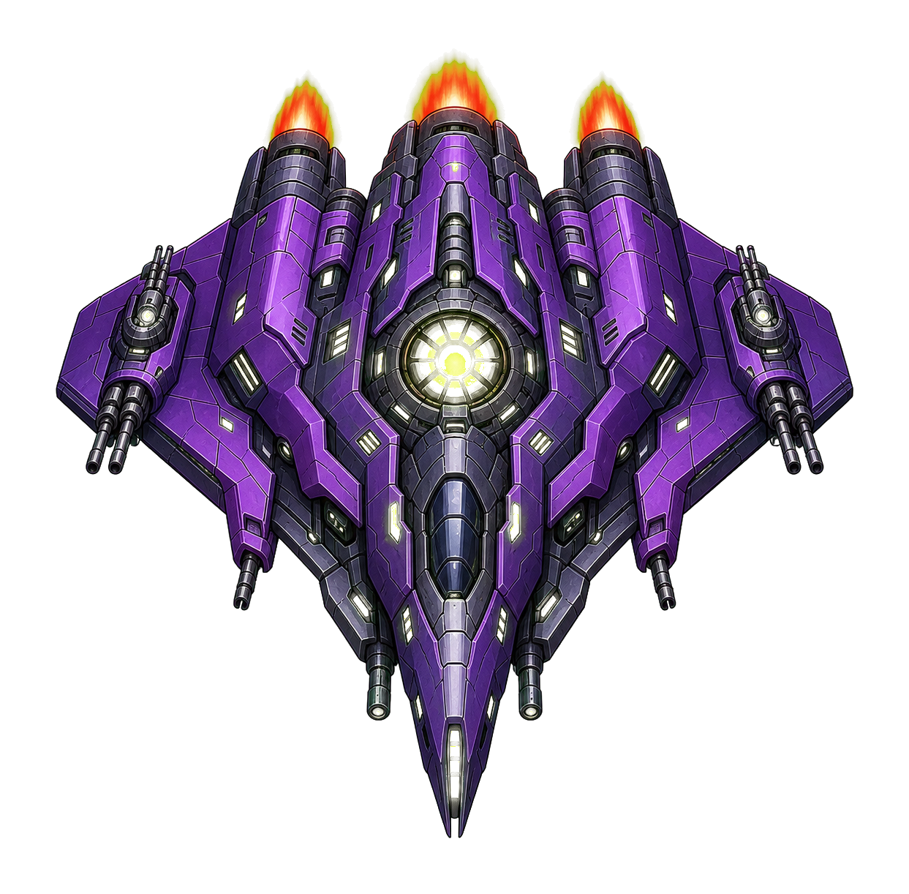 | 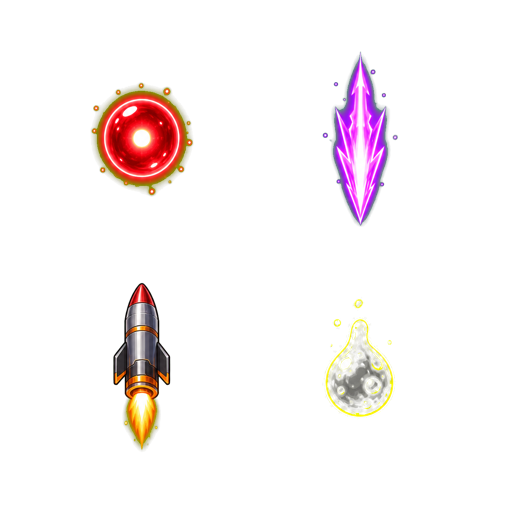 |

| Powerups | Asteroid Explosion | Ship Death Explosion |
| --- | --- | --- |
| 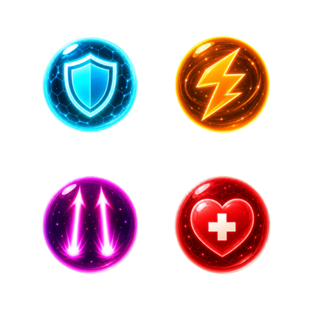 | 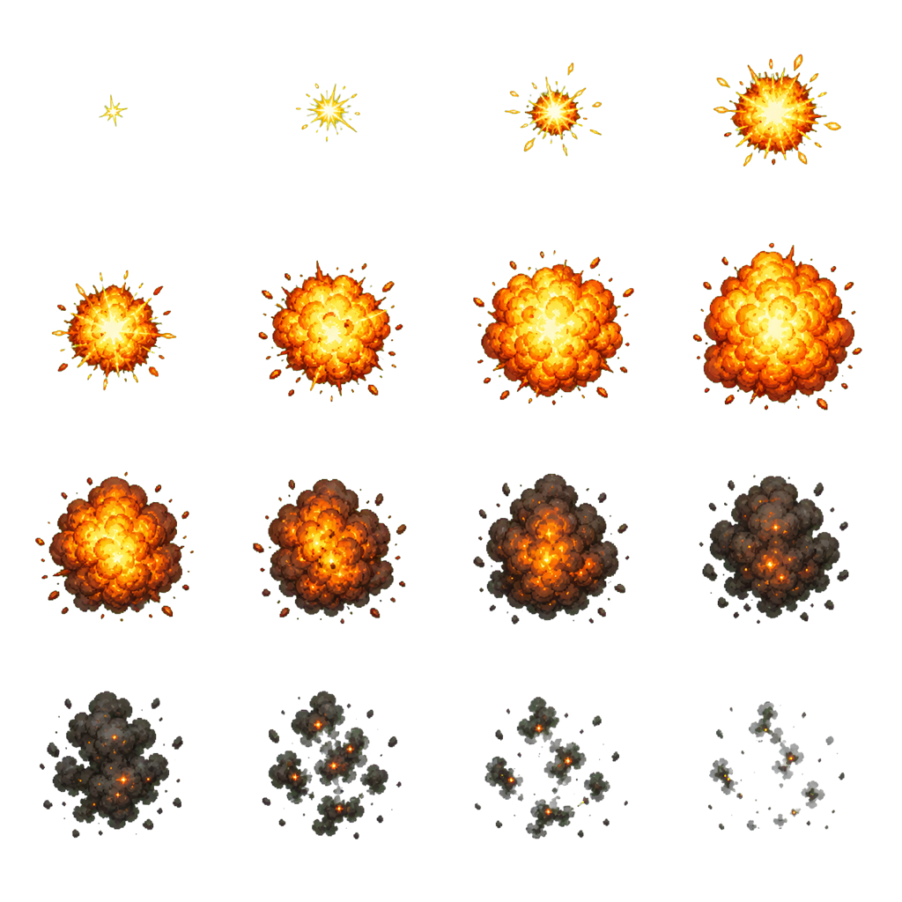 | 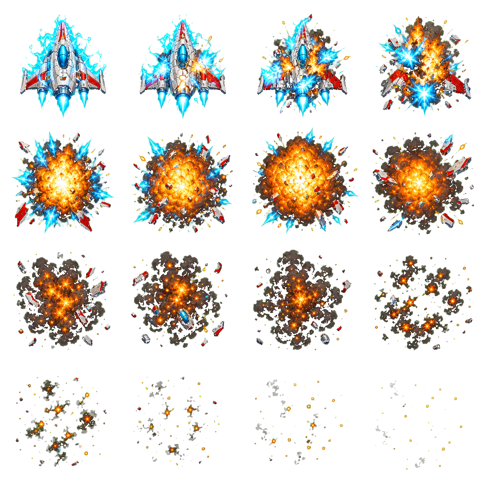 |

## Background Art

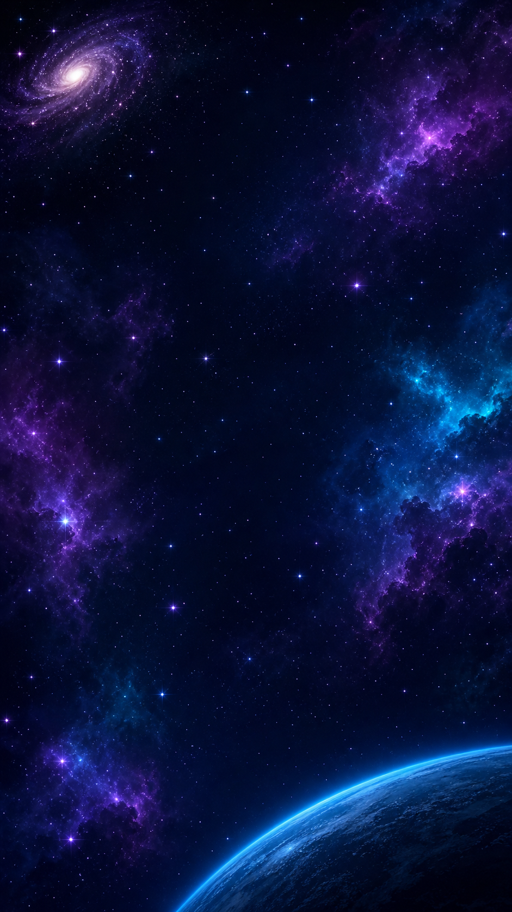

## Run

```bash
npm install
npm run dev
```

Open the local Vite URL shown in the terminal.

## Controls

- `WASD` or arrow keys: fly
- `Space`, mouse, or touch: fire
- `P`: pause
- `R`: restart after game over
